- # 🚀 Get Hired: Your Ultimate AI-Powered Job Search Toolkit
Get Hired is a full-stack web application designed to revolutionize the job search experience. Built with a powerful combination of Spring Boot, React, and cutting-edge technologies, this platform provides job seekers with a unified, intelligent, and data-driven approach to landing their dream job.

- ## ✨ Features
Get Hired is more than just a job board—it's a comprehensive career dashboard that empowers you with insights and tools to stand out in a competitive market.

1. ### AI-Powered Resume Analyzer: Upload your resume and get an instant, data-driven score and detailed feedback. Our AI model provides recommendations to optimize your resume for Applicant Tracking Systems (ATS), increasing your chances of getting noticed by recruiters.

2. ### LinkedIn Integration & Job Scraping: Seamlessly log in with your Google or LinkedIn account. Our application scrapes relevant job listings from LinkedIn using Selenium, providing you with a centralized feed of the latest opportunities without the hassle of tab-hopping.

3. ### Personalized Career Growth Analysis: Track your progress over time with our dynamic charts and dashboards. Visualize key metrics such as:

4. ### Resume Score Improvement: See how your resume score has evolved as you incorporate our AI's suggestions.

5. ### Skill Acquisition: Monitor the new skills you've learned and their impact on your profile.

6. ### Application & Interview Analytics: Gain insights into your job application funnel—from the number of jobs applied for to the interviews secured and offers received.

7. ### Actionable Insights: Our platform provides clear, concise recommendations to help you improve your resume, tailor your applications to specific job descriptions, and enhance your overall professional profile.

8. ### Robust Backend with Modern Tech Stack: Built on a microservices-friendly architecture, the application leverages:
                                                                                                                                                                                                                  
9. ### Gemini AI Model: The core of our resume analysis and personalized recommendations.

10. ### Interactive UI: A modern and intuitive user interface built with React and visualized with Chart.js makes it easy to track your progress and understand your data at a glance.
                                                                                                                                                                                                                      
- ## 🛠️ Tech Stack
Frontend: <p align="center">
  
</p>

Backend: <p align="center">
  
</p>

Database:  <p align="center">
  
</p>

AI/ML: <p align="center">

</p>

Caching & Messaging: <p align="center">

</p>

Web Scraping: <p align="center">

</p>

Authentication: OAuth <p align="center">

</p>

- ### 📷 Screenshots
Here are some glimpses of the Get Hired application in action:

 ## Homepage: A welcoming landing page that introduces the platform's core value proposition.
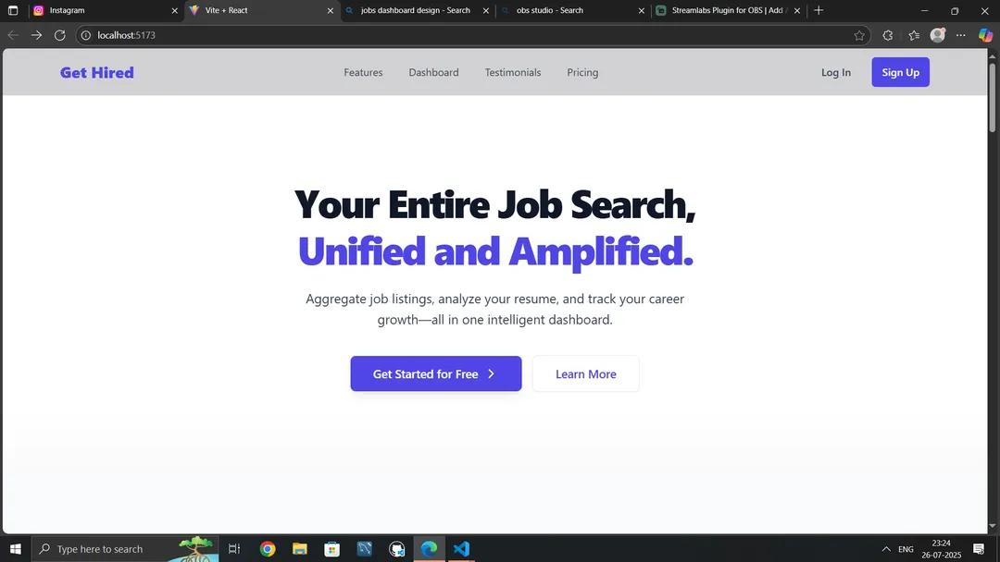                                                                                                                                                                                                          
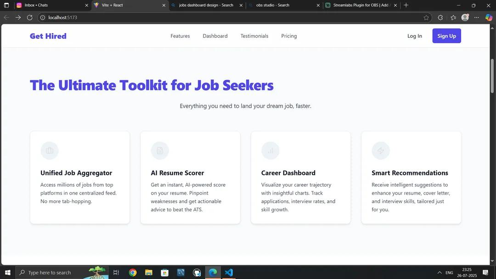                                                                                                                                                               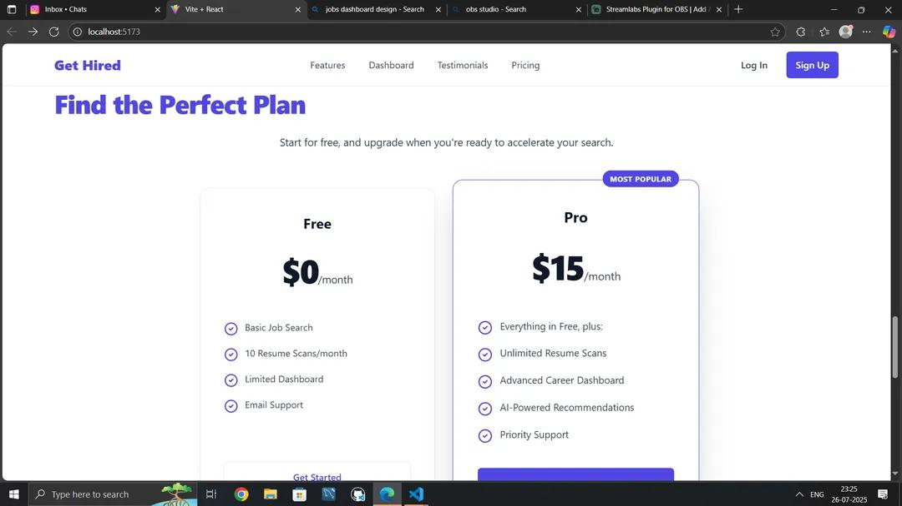                                                                                                                                                               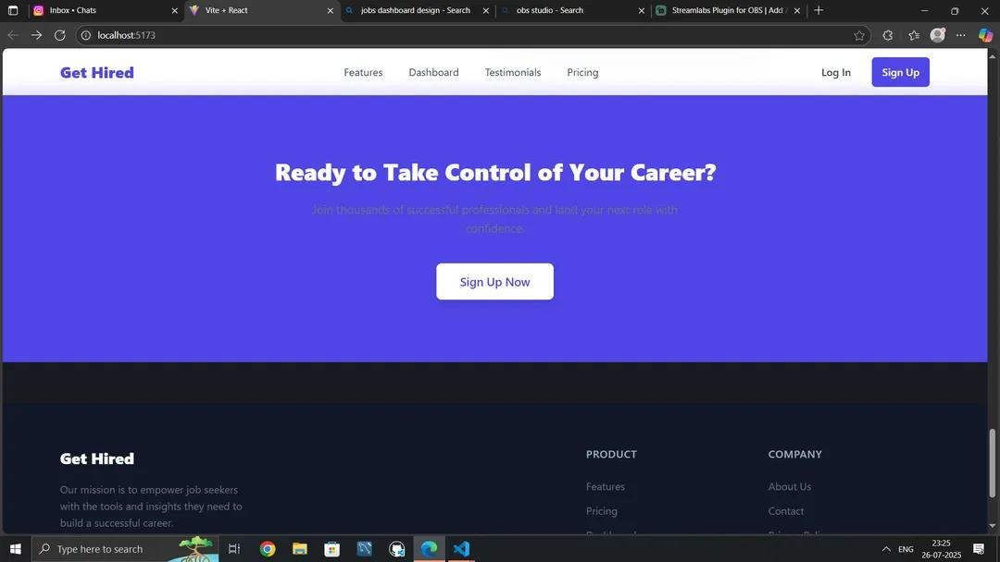
 ## AI Resume Analyzer Dashboard: The main dashboard where users can see their resume score and detailed analysis.                                                                                                        
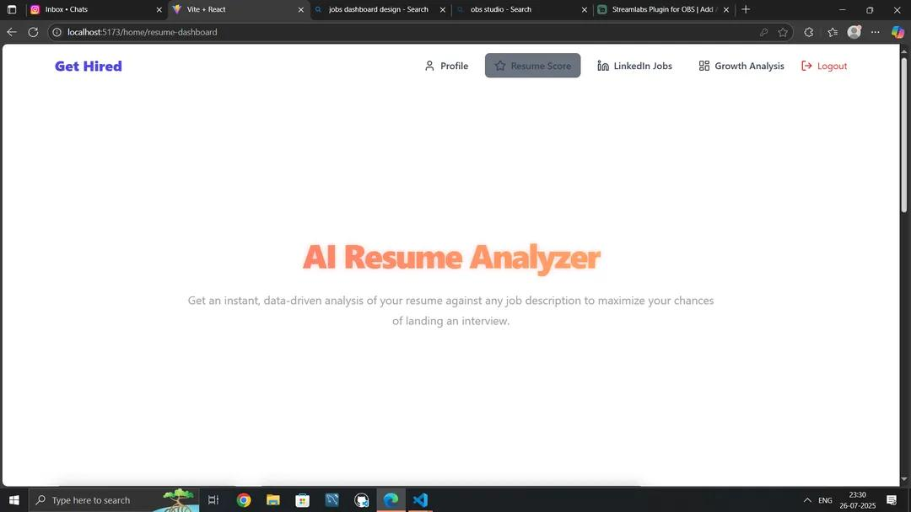                                                                                                                                      
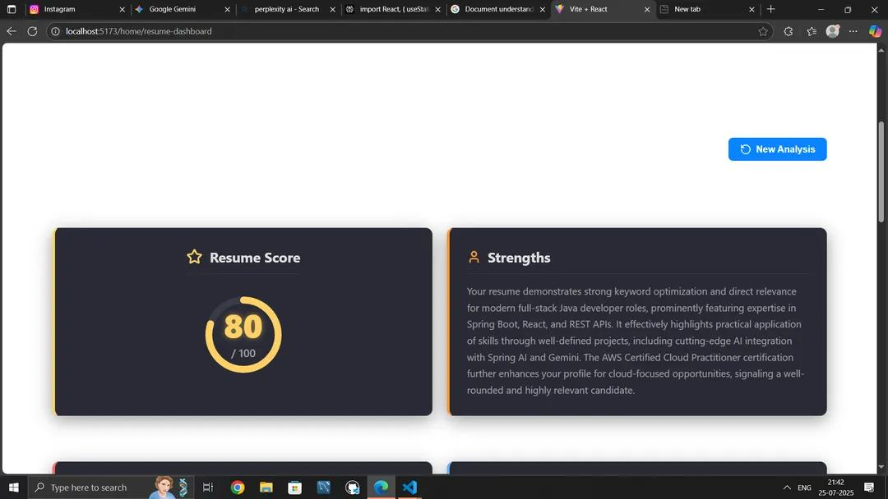
 ## Detailed Analysis & Recommendations:

## Grammatical Issues: A breakdown of grammatical errors and typos with recommendations.
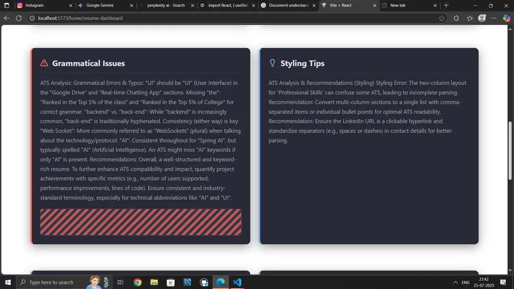

## Key Improvements: Specific, action-oriented advice to enhance the resume's content.
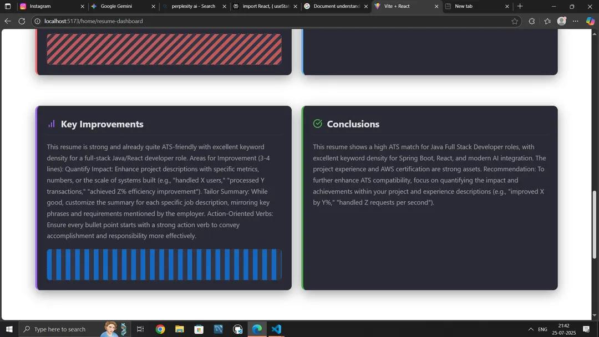                                                                                                                                                                                                                                                                                                                                                                        
## Login & User Experience:
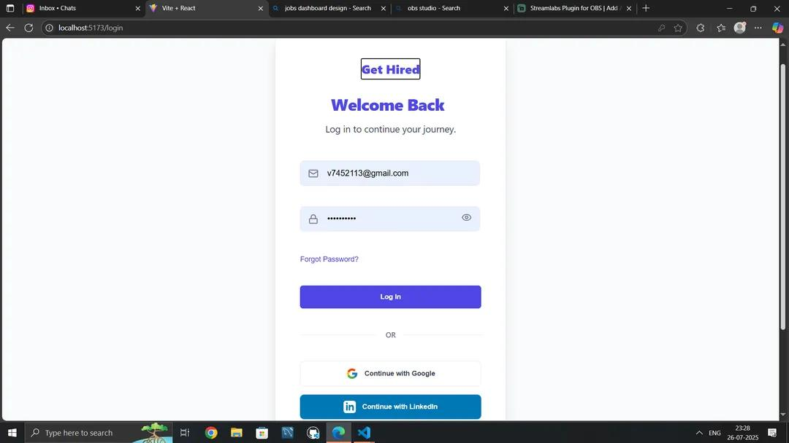
Login Page: Simple and secure login options, including Google and LinkedIn.
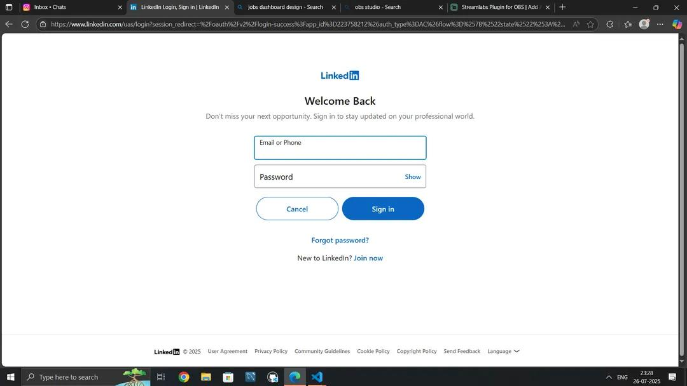

## LinkedIn Job Search: A unified dashboard to search for jobs and track your application status.
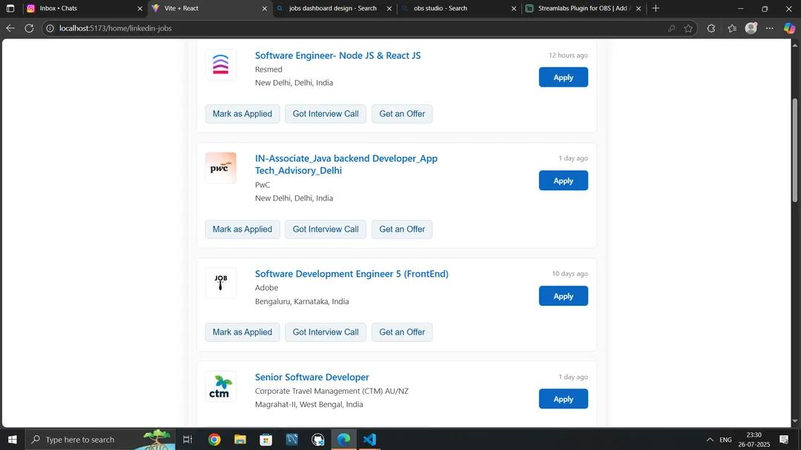

## Growth Analysis: Visual representations of your career progression over time.
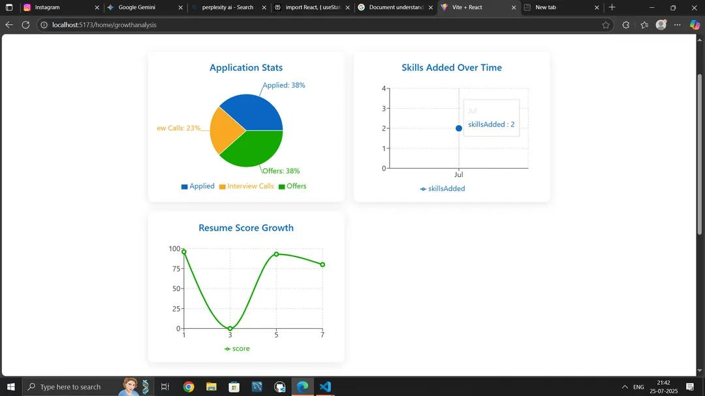

User Profile: A clean and organized profile section to manage your experience, education, skills, and certifications.
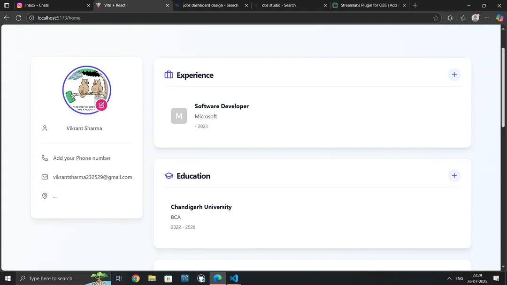
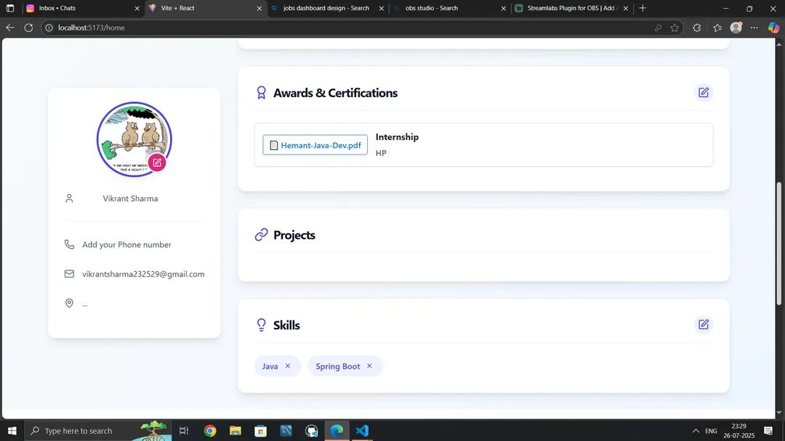
                                                                                                                                                                                                                 # # 🏁 Getting Started
To get a local copy up and running, follow these simple steps.

# Prerequisites
Before you begin, make sure you have the following software installed on your machine:

1. ### Java 17 or higher

2. ### Maven

3. ### Node.js 18 or higher

4. ### npm or yarn

5. ### Docker and Docker Compose (recommended for an easier setup)

6. ### A running instance of MongoDB, Redis, and Kafka.

# Installation
## Clone the repository

```Bash```

```git clone https://github.com/your-username/your-repo-name.git```
```cd your-repo-name```
Set up Environment Variables
Create a .env file in the root directory of the project and add the following configuration. Replace the placeholder values with your actual credentials.

Bash

# Spring Boot Backend Configuration
```MONGODB_URI=mongodb://localhost:27017/gethired```
```KAFKA_BROKERS=localhost:9092```
```REDIS_URI=redis://localhost:6379```

# Gemini AI Configuration
```GEMINI_API_KEY=YOUR_GEMINI_API_KEY```

# OAuth Configuration
```GOOGLE_OAUTH_CLIENT_ID=YOUR_GOOGLE_CLIENT_ID```
```GOOGLE_OAUTH_CLIENT_SECRET=YOUR_GOOGLE_CLIENT_SECRET```
```LINKEDIN_OAUTH_CLIENT_ID=YOUR_LINKEDIN_CLIENT_ID```
```LINKEDIN_OAUTH_CLIENT_SECRET=YOUR_LINKEDIN_CLIENT_SECRET```

# Selenium Configuration (if needed for local scraping)
```SELENIUM_WEBDRIVER_PATH=/path/to/your/webdriver```
# Start the Backend (Spring Boot)
### Navigate to the backend directory and run the application using Maven.

```Bash```

```cd backend```
```./mvnw spring-boot:run```
The backend will start on http://localhost:8080 by default.

# Start the Frontend (React)
Open a new terminal, navigate to the frontend directory, and start the React development server.

Bash

```cd frontend```
```npm install```
```npm start```
The frontend will start on http://localhost:5173 by default.

### Access the Application
Open your web browser and navigate to `http://localhost:3000` to see the application in action.

### Using Docker (Recommended)
If you have Docker and Docker Compose installed, you can start the entire stack with a single command.

Configure `.env` file: Ensure your .env file is configured as described in step 2 above.

### Start the services:

Bash

```docker-compose up```
This command will build the Docker images and start all services, including the database, caching, and both the frontend and backend. The application will be accessible at http://localhost:5173.
